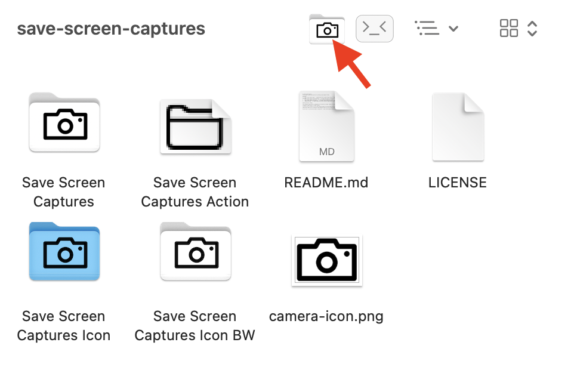

# OSX application for setting screen capture folder

### Index
* ```Save Screen Captures.app``` - Automator application that sets folder for screen captures.
* ```Save Screen Captures Action.workflow``` - Finder Quick Action workflow to set folder for screen captures.
* ```Save Screen Captures Icon.icns``` - Color version of application icon.
* ```Save Screen Captures Icon BW.icns``` - Default black-n-white version of application icon.
* ```camera-icon.png``` - Simple camera icon source used for applications icons.

### Installation & Usage
This Automator application is designed to be installed into Finder toolbar. To install, press <kbd>Command</kbd> while dragging the application to Finder toolbar.

To set screen capture folder, click the icon in toolbar. You can also drop folders and files to application. When file is received, screen capture folder is to set to the folder where file is located.

To uninstall, press <kbd>Command</kbd> while dragging the toolbar button away.

Quick Action is installed by double clicking the ```Save Screen Captures Action``` -icon.



### TODO

* Now the only way to restore default setting (saving screen captures to desktop) is either open Desktop in Finder and click toolbar icon, or drop a file from desktop to application icon. If it would be possible to detect if application is run from toolbar, it would be nice to have restore function when application icon is double-clicked. Unfortunately it seems there is no way to tell the difference between toolbar and ´normal´ execution.

* Toolbar icon should have OSX native look.


### References

[How to Add “Console Here” Button to Finders Toolbar, or Any Other Action Button](https://medium.com/@n1kk/how-to-add-console-here-button-to-finder-toolbar-or-any-other-action-button-84dae9c34891)
[Change the Screen Shot Save File Location in Mac OS X](https://osxdaily.com/2011/01/26/change-the-screenshot-save-file-location-in-mac-os-x/)
